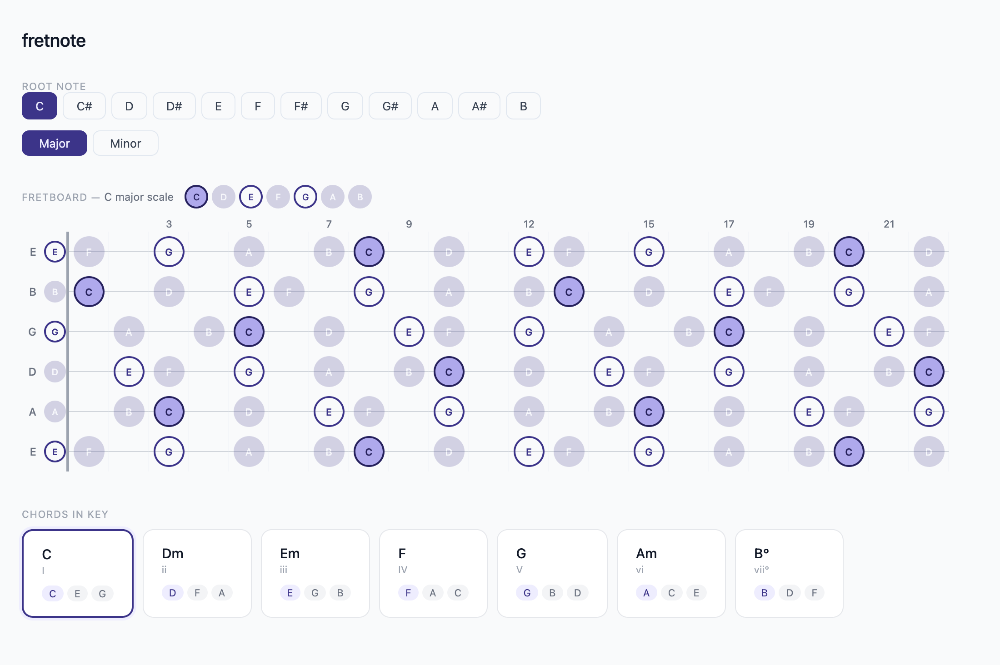

# fretnote

An interactive guitar fretboard visualization tool for learning music theory, scales, and chord progressions.

**Demo screenshot:**



## Features

- Interactive guitar fretboard visualization
- Root note selector (all 12 notes)
- Major and minor scale modes
- Automatic chord progression display (diatonic chords in key)
- Note highlighting on the fretboard

## Tech Stack

- React 18.3.1
- Vite 5.4.2

## Getting Started

### Prerequisites

- Node.js (v16 or higher recommended)
- pnpm (v10.11.0)

### Installation

```bash
pnpm install
```

### Development

```bash
pnpm dev
```

### Build

```bash
pnpm build
```

### Preview Production Build

```bash
pnpm preview
```

## Project Structure

```
src/
├── App.jsx              # Main application component
├── main.jsx             # React entry point
├── utils/
│   └── theory.js        # Music theory utilities (scales, chords, intervals)
└── components/
    ├── Fretboard.jsx    # Guitar fretboard visualization
    ├── FretboardHeader.jsx
    ├── StringRow.jsx
    ├── FretNote.jsx
    ├── RootSelector.jsx # Root note and mode selector
    ├── ScaleNotes.jsx
    ├── ChordGrid.jsx    # Chord progression display
    ├── ChordCard.jsx    # Individual chord card
    └── ChordModifier.jsx # Chord extension options
```

## License

MIT
